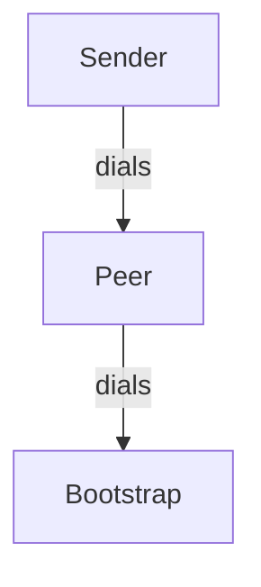

# LibP2P Implementation with Docker Swarm

This guide describes an implementation of LibP2P with the following configuration:

- MDNS (optional, yet to be done)
- Kademlia for peer routing
- GossipSub for pub/sub messaging
- QUIC for transport


## Quick Start

To get started, follow these commands:

```
# Build the Docker image
./build.sh

# Deploy to Docker Swarm
./deploy.sh
```

## Inspecting the output

Viewing the output shows the interaction between containers worked:

```
./inspect.sh

=================================
           BOOTSTRAP
=================================
p2p_bootstrap.1.zedwk7e9qqnu@nixos    | 2024-12-17T12:03:27.778391Z  INFO p2p_service: STARTING!
p2p_bootstrap.1.zedwk7e9qqnu@nixos    | 2024-12-17T12:03:27.780127Z  INFO libp2p_swarm: local_peer_id=12D3KooWEWkkfDUnn6CjvabTF9ussb1wqCbaZkpVAn7dGx5DE7mz
p2p_bootstrap.1.zedwk7e9qqnu@nixos    | 2024-12-17T12:03:27.780668Z  INFO p2p_service: Local node is listening on /ip4/127.0.0.1/udp/4001/quic-v1
p2p_bootstrap.1.zedwk7e9qqnu@nixos    | 2024-12-17T12:03:27.780728Z  INFO p2p_service: Local node is listening on /ip4/10.0.11.5/udp/4001/quic-v1
p2p_bootstrap.1.zedwk7e9qqnu@nixos    | 2024-12-17T12:03:27.780776Z  INFO p2p_service: Local node is listening on /ip4/172.22.0.5/udp/4001/quic-v1
p2p_bootstrap.1.zedwk7e9qqnu@nixos    | 2024-12-17T12:03:28.281072Z  WARN libp2p_kad::behaviour: Failed to trigger bootstrap: No known peers.
p2p_bootstrap.1.zedwk7e9qqnu@nixos    | 2024-12-17T12:03:33.175661Z  INFO p2p_service: Connected to 12D3KooWRnA2hQsKNh9n66qVubCgXzSxCSxUQsFG1x2RNWLHrr9t
p2p_bootstrap.1.zedwk7e9qqnu@nixos    | 2024-12-17T12:03:33.175768Z  INFO p2p_service: Added address to kademlia /ip4/10.0.11.2/udp/4001/quic-v1
p2p_bootstrap.1.zedwk7e9qqnu@nixos    | 2024-12-17T12:03:33.175809Z  INFO p2p_service: Added peer to gossipsub /ip4/10.0.11.2/udp/4001/quic-v1
p2p_bootstrap.1.zedwk7e9qqnu@nixos    | 2024-12-17T12:03:33.175851Z  INFO p2p_service: Other Kademlia event: RoutingUpdated { peer: PeerId("12D3KooWRnA2hQsKNh9n66qVubCgXzSxCSxUQsFG1x2RNWLHrr9t"), is_new_peer: true, addresses: [/ip4/10.0.11.2/udp/4001/quic-v1/p2p/12D3KooWRnA2hQsKNh9n66qVubCgXzSxCSxUQsFG1x2RNWLHrr9t], bucket_range: (Distance(28948022309329048855892746252171976963317496166410141009864396001978282409984), Distance(57896044618658097711785492504343953926634992332820282019728792003956564819967)), old_peer: None }
p2p_bootstrap.1.zedwk7e9qqnu@nixos    | 2024-12-17T12:03:33.677848Z  INFO p2p_service: Other Kademlia event: OutboundQueryProgressed { id: QueryId(0), result: Bootstrap(Ok(BootstrapOk { peer: PeerId("12D3KooWEWkkfDUnn6CjvabTF9ussb1wqCbaZkpVAn7dGx5DE7mz"), num_remaining: 1 })), stats: QueryStats { requests: 1, success: 0, failure: 1, start: Some(Instant { tv_sec: 23328, tv_nsec: 94887437 }), end: Some(Instant { tv_sec: 23328, tv_nsec: 96514322 }) }, step: ProgressStep { count: 1, last: false } }
p2p_bootstrap.1.zedwk7e9qqnu@nixos    | 2024-12-17T12:03:33.678683Z  INFO p2p_service: Other Kademlia event: OutboundQueryProgressed { id: QueryId(0), result: Bootstrap(Ok(BootstrapOk { peer: PeerId("1Abx3Yd8kninxukBFkSGcaTCPqXqe4SAY8K1Cwx4EFFUAu"), num_remaining: 0 })), stats: QueryStats { requests: 1, success: 0, failure: 1, start: Some(Instant { tv_sec: 23328, tv_nsec: 96789390 }), end: Some(Instant { tv_sec: 23328, tv_nsec: 97543697 }) }, step: ProgressStep { count: 2, last: true } }

=================================
           PEER
=================================
p2p_peer.1.kad5uoxc6846@nixos    | 2024-12-17T12:03:19.168384Z  INFO p2p_service: STARTING!
p2p_peer.1.kad5uoxc6846@nixos    | 2024-12-17T12:03:19.170179Z  INFO libp2p_swarm: local_peer_id=12D3KooWRnA2hQsKNh9n66qVubCgXzSxCSxUQsFG1x2RNWLHrr9t
p2p_peer.1.kad5uoxc6846@nixos    | Now dialing in to bootstrap
p2p_peer.1.kad5uoxc6846@nixos    | 2024-12-17T12:03:19.170753Z  INFO p2p_service: Local node is listening on /ip4/127.0.0.1/udp/4001/quic-v1
p2p_peer.1.kad5uoxc6846@nixos    | 2024-12-17T12:03:19.170814Z  INFO p2p_service: Local node is listening on /ip4/10.0.11.2/udp/4001/quic-v1
p2p_peer.1.kad5uoxc6846@nixos    | 2024-12-17T12:03:19.170864Z  INFO p2p_service: Local node is listening on /ip4/172.22.0.3/udp/4001/quic-v1
p2p_peer.1.kad5uoxc6846@nixos    | Resolved 'bootstrap' to
p2p_peer.1.kad5uoxc6846@nixos    | addr:/ip4//udp/4001/quic-v1
p2p_peer.1.kad5uoxc6846@nixos    | Attempt 1/10 failed, retrying in 100ms: failed to parse: invalid IPv4 address syntax
p2p_peer.1.kad5uoxc6846@nixos    | Resolved 'bootstrap' to
p2p_peer.1.kad5uoxc6846@nixos    | addr:/ip4//udp/4001/quic-v1
p2p_peer.1.kad5uoxc6846@nixos    | Attempt 2/10 failed, retrying in 200ms: failed to parse: invalid IPv4 address syntax
p2p_peer.1.kad5uoxc6846@nixos    | 2024-12-17T12:03:19.671251Z  WARN libp2p_kad::behaviour: Failed to trigger bootstrap: No known peers.
p2p_peer.1.kad5uoxc6846@nixos    | Resolved 'bootstrap' to
p2p_peer.1.kad5uoxc6846@nixos    | addr:/ip4//udp/4001/quic-v1
p2p_peer.1.kad5uoxc6846@nixos    | Attempt 3/10 failed, retrying in 400ms: failed to parse: invalid IPv4 address syntax
p2p_peer.1.kad5uoxc6846@nixos    | Resolved 'bootstrap' to
p2p_peer.1.kad5uoxc6846@nixos    | addr:/ip4//udp/4001/quic-v1
p2p_peer.1.kad5uoxc6846@nixos    | Attempt 4/10 failed, retrying in 800ms: failed to parse: invalid IPv4 address syntax
p2p_peer.1.kad5uoxc6846@nixos    | Resolved 'bootstrap' to
p2p_peer.1.kad5uoxc6846@nixos    | addr:/ip4//udp/4001/quic-v1
p2p_peer.1.kad5uoxc6846@nixos    | Attempt 5/10 failed, retrying in 1600ms: failed to parse: invalid IPv4 address syntax
p2p_peer.1.kad5uoxc6846@nixos    | Resolved 'bootstrap' to
p2p_peer.1.kad5uoxc6846@nixos    | addr:/ip4//udp/4001/quic-v1
p2p_peer.1.kad5uoxc6846@nixos    | Attempt 6/10 failed, retrying in 3200ms: failed to parse: invalid IPv4 address syntax
p2p_peer.1.kad5uoxc6846@nixos    | 2024-12-17T12:03:23.503587Z  INFO p2p_service: Connected to 12D3KooWNzzY9wBW5PzMyur4RgEXUwxBYF6cyYWKczsZBffL3ezM
p2p_peer.1.kad5uoxc6846@nixos    | 2024-12-17T12:03:23.503684Z  INFO p2p_service: Added address to kademlia /ip4/10.0.11.4/udp/4001/quic-v1
p2p_peer.1.kad5uoxc6846@nixos    | 2024-12-17T12:03:23.503700Z  INFO p2p_service: Added peer to gossipsub /ip4/10.0.11.4/udp/4001/quic-v1
p2p_peer.1.kad5uoxc6846@nixos    | 2024-12-17T12:03:23.503733Z  INFO p2p_service: Other Kademlia event: RoutingUpdated { peer: PeerId("12D3KooWNzzY9wBW5PzMyur4RgEXUwxBYF6cyYWKczsZBffL3ezM"), is_new_peer: true, addresses: [/ip4/10.0.11.4/udp/4001/quic-v1/p2p/12D3KooWNzzY9wBW5PzMyur4RgEXUwxBYF6cyYWKczsZBffL3ezM], bucket_range: (Distance(57896044618658097711785492504343953926634992332820282019728792003956564819968), Distance(115792089237316195423570985008687907853269984665640564039457584007913129639935)), old_peer: None }
p2p_peer.1.kad5uoxc6846@nixos    | 2024-12-17T12:03:23.598423Z  INFO p2p_service: Got message with id: 38323236333237303236323337393839363739 from peer: 12D3KooWNzzY9wBW5PzMyur4RgEXUwxBYF6cyYWKczsZBffL3ezM
p2p_peer.1.kad5uoxc6846@nixos    | Received raw message data: [1, 2, 3, 4]
p2p_peer.1.kad5uoxc6846@nixos    | 2024-12-17T12:03:24.005150Z  INFO p2p_service: Other Kademlia event: OutboundQueryProgressed { id: QueryId(0), result: Bootstrap(Ok(BootstrapOk { peer: PeerId("12D3KooWRnA2hQsKNh9n66qVubCgXzSxCSxUQsFG1x2RNWLHrr9t"), num_remaining: 0 })), stats: QueryStats { requests: 1, success: 0, failure: 1, start: Some(Instant { tv_sec: 23318, tv_nsec: 422740719 }), end: Some(Instant { tv_sec: 23318, tv_nsec: 423965131 }) }, step: ProgressStep { count: 1, last: true } }
p2p_peer.1.kad5uoxc6846@nixos    | Resolved 'bootstrap' to
p2p_peer.1.kad5uoxc6846@nixos    | addr:/ip4//udp/4001/quic-v1
p2p_peer.1.kad5uoxc6846@nixos    | Attempt 7/10 failed, retrying in 6400ms: failed to parse: invalid IPv4 address syntax
p2p_peer.1.kad5uoxc6846@nixos    | Resolved 'bootstrap' to 10.0.11.5
p2p_peer.1.kad5uoxc6846@nixos    | addr:/ip4/10.0.11.5/udp/4001/quic-v1
p2p_peer.1.kad5uoxc6846@nixos    | Dialing: /ip4/10.0.11.5/udp/4001/quic-v1...
p2p_peer.1.kad5uoxc6846@nixos    | Dialing /ip4/10.0.11.5/udp/4001/quic-v1 with connection 2
p2p_peer.1.kad5uoxc6846@nixos    | 2024-12-17T12:03:33.160986Z  INFO p2p_service: Connected to 12D3KooWEWkkfDUnn6CjvabTF9ussb1wqCbaZkpVAn7dGx5DE7mz
p2p_peer.1.kad5uoxc6846@nixos    | 2024-12-17T12:03:33.161148Z  INFO p2p_service: Added address to kademlia /ip4/10.0.11.5/udp/4001/quic-v1
p2p_peer.1.kad5uoxc6846@nixos    | 2024-12-17T12:03:33.161173Z  INFO p2p_service: Added peer to gossipsub /ip4/10.0.11.5/udp/4001/quic-v1
p2p_peer.1.kad5uoxc6846@nixos    | Connection Established
p2p_peer.1.kad5uoxc6846@nixos    | 2024-12-17T12:03:33.161240Z  INFO p2p_service: Other Kademlia event: RoutingUpdated { peer: PeerId("12D3KooWEWkkfDUnn6CjvabTF9ussb1wqCbaZkpVAn7dGx5DE7mz"), is_new_peer: true, addresses: [/ip4/10.0.11.5/udp/4001/quic-v1/p2p/12D3KooWEWkkfDUnn6CjvabTF9ussb1wqCbaZkpVAn7dGx5DE7mz], bucket_range: (Distance(28948022309329048855892746252171976963317496166410141009864396001978282409984), Distance(57896044618658097711785492504343953926634992332820282019728792003956564819967)), old_peer: None }
p2p_peer.1.kad5uoxc6846@nixos    | 2024-12-17T12:03:33.176523Z  INFO p2p_service: Other Kademlia event: RoutingUpdated { peer: PeerId("12D3KooWEWkkfDUnn6CjvabTF9ussb1wqCbaZkpVAn7dGx5DE7mz"), is_new_peer: false, addresses: [/ip4/10.0.11.5/udp/4001/quic-v1/p2p/12D3KooWEWkkfDUnn6CjvabTF9ussb1wqCbaZkpVAn7dGx5DE7mz, /ip4/10.0.11.5/udp/4001/quic-v1], bucket_range: (Distance(28948022309329048855892746252171976963317496166410141009864396001978282409984), Distance(57896044618658097711785492504343953926634992332820282019728792003956564819967)), old_peer: None }
p2p_peer.1.kad5uoxc6846@nixos    | 2024-12-17T12:03:33.662824Z  INFO p2p_service: Other Kademlia event: OutboundQueryProgressed { id: QueryId(1), result: Bootstrap(Ok(BootstrapOk { peer: PeerId("12D3KooWRnA2hQsKNh9n66qVubCgXzSxCSxUQsFG1x2RNWLHrr9t"), num_remaining: 1 })), stats: QueryStats { requests: 2, success: 0, failure: 2, start: Some(Instant { tv_sec: 23328, tv_nsec: 80207841 }), end: Some(Instant { tv_sec: 23328, tv_nsec: 81536551 }) }, step: ProgressStep { count: 1, last: false } }
p2p_peer.1.kad5uoxc6846@nixos    | 2024-12-17T12:03:33.663631Z  INFO p2p_service: Other Kademlia event: OutboundQueryProgressed { id: QueryId(1), result: Bootstrap(Ok(BootstrapOk { peer: PeerId("1AfUKey4ENiMi6dD48aNLn5r2d3jzJ8TG37ZJeWThyVt9T"), num_remaining: 0 })), stats: QueryStats { requests: 2, success: 0, failure: 2, start: Some(Instant { tv_sec: 23328, tv_nsec: 81753090 }), end: Some(Instant { tv_sec: 23328, tv_nsec: 82489330 }) }, step: ProgressStep { count: 2, last: true } }

=================================
           SENDER
=================================
p2p_sender.1.pqrz6m8nd5ls@nixos    | 2024-12-17T12:03:23.118585Z  INFO p2p_service: STARTING!
p2p_sender.1.pqrz6m8nd5ls@nixos    | 2024-12-17T12:03:23.120277Z  INFO libp2p_swarm: local_peer_id=12D3KooWNzzY9wBW5PzMyur4RgEXUwxBYF6cyYWKczsZBffL3ezM
p2p_sender.1.pqrz6m8nd5ls@nixos    | Now dialing in to peer
p2p_sender.1.pqrz6m8nd5ls@nixos    | 2024-12-17T12:03:23.120784Z  INFO p2p_service: Local node is listening on /ip4/127.0.0.1/udp/4001/quic-v1
p2p_sender.1.pqrz6m8nd5ls@nixos    | 2024-12-17T12:03:23.120843Z  INFO p2p_service: Local node is listening on /ip4/10.0.11.4/udp/4001/quic-v1
p2p_sender.1.pqrz6m8nd5ls@nixos    | 2024-12-17T12:03:23.120885Z  INFO p2p_service: Local node is listening on /ip4/172.22.0.4/udp/4001/quic-v1
p2p_sender.1.pqrz6m8nd5ls@nixos    | Resolved 'peer' to 10.0.11.2
p2p_sender.1.pqrz6m8nd5ls@nixos    | addr:/ip4/10.0.11.2/udp/4001/quic-v1
p2p_sender.1.pqrz6m8nd5ls@nixos    | Dialing: /ip4/10.0.11.2/udp/4001/quic-v1...
p2p_sender.1.pqrz6m8nd5ls@nixos    | Dialing /ip4/10.0.11.2/udp/4001/quic-v1 with connection 1
p2p_sender.1.pqrz6m8nd5ls@nixos    | 2024-12-17T12:03:23.489202Z  INFO p2p_service: Connected to 12D3KooWRnA2hQsKNh9n66qVubCgXzSxCSxUQsFG1x2RNWLHrr9t
p2p_sender.1.pqrz6m8nd5ls@nixos    | 2024-12-17T12:03:23.489309Z  INFO p2p_service: Added address to kademlia /ip4/10.0.11.2/udp/4001/quic-v1
p2p_sender.1.pqrz6m8nd5ls@nixos    | 2024-12-17T12:03:23.489325Z  INFO p2p_service: Added peer to gossipsub /ip4/10.0.11.2/udp/4001/quic-v1
p2p_sender.1.pqrz6m8nd5ls@nixos    | Connection Established
p2p_sender.1.pqrz6m8nd5ls@nixos    | Sending message 1,2,3,4...
p2p_sender.1.pqrz6m8nd5ls@nixos    | Now publishing data [1, 2, 3, 4] on topic some_topic
p2p_sender.1.pqrz6m8nd5ls@nixos    | 2024-12-17T12:03:23.489371Z  INFO p2p_service: Other Kademlia event: RoutingUpdated { peer: PeerId("12D3KooWRnA2hQsKNh9n66qVubCgXzSxCSxUQsFG1x2RNWLHrr9t"), is_new_peer: true, addresses: [/ip4/10.0.11.2/udp/4001/quic-v1/p2p/12D3KooWRnA2hQsKNh9n66qVubCgXzSxCSxUQsFG1x2RNWLHrr9t], bucket_range: (Distance(57896044618658097711785492504343953926634992332820282019728792003956564819968), Distance(115792089237316195423570985008687907853269984665640564039457584007913129639935)), old_peer: None }
p2p_sender.1.pqrz6m8nd5ls@nixos    | 2024-12-17T12:03:23.489770Z  WARN p2p_service: Could not publish to swarm. Retrying... error=InsufficientPeers
p2p_sender.1.pqrz6m8nd5ls@nixos    | Attempt 1/10 failed, retrying in 100ms: Publishing failed
p2p_sender.1.pqrz6m8nd5ls@nixos    | 2024-12-17T12:03:23.504455Z  INFO p2p_service: Other Kademlia event: RoutingUpdated { peer: PeerId("12D3KooWRnA2hQsKNh9n66qVubCgXzSxCSxUQsFG1x2RNWLHrr9t"), is_new_peer: false, addresses: [/ip4/10.0.11.2/udp/4001/quic-v1/p2p/12D3KooWRnA2hQsKNh9n66qVubCgXzSxCSxUQsFG1x2RNWLHrr9t, /ip4/10.0.11.2/udp/4001/quic-v1], bucket_range: (Distance(57896044618658097711785492504343953926634992332820282019728792003956564819968), Distance(115792089237316195423570985008687907853269984665640564039457584007913129639935)), old_peer: None }
p2p_sender.1.pqrz6m8nd5ls@nixos    | Publish has been confirmed with id: 38323236333237303236323337393839363739
p2p_sender.1.pqrz6m8nd5ls@nixos    | Sent and array of bytes 1,2,3,4 to be gossiped
p2p_sender.1.pqrz6m8nd5ls@nixos    | 2024-12-17T12:03:23.991063Z  INFO p2p_service: Other Kademlia event: OutboundQueryProgressed { id: QueryId(0), result: Bootstrap(Ok(BootstrapOk { peer: PeerId("12D3KooWNzzY9wBW5PzMyur4RgEXUwxBYF6cyYWKczsZBffL3ezM"), num_remaining: 0 })), stats: QueryStats { requests: 1, success: 0, failure: 1, start: Some(Instant { tv_sec: 23318, tv_nsec: 408290472 }), end: Some(Instant { tv_sec: 23318, tv_nsec: 409883268 }) }, step: ProgressStep { count: 1, last: true } }
```

## Network Architecture

The implementation consists of three main components:

- Bootstrap Node: Acts as the initial entry point for the P2P network
- Peer Node: A standard network participant that connects to the bootstrap node
- Sender Node: Connects to the peer node and sends messages through the network


The network topology follows this pattern:



## Network Considerations

When deploying this system in Docker Swarm, there are important networking considerations to keep in mind:

### Docker Swarm Networking Behavior

Docker Swarm uses an internal IP load balancer which can affect network transports, particularly QUIC. This creates two key challenges:

1. Container IP Address Translation:
    - A container's internal IP address differs from the IP address other containers use to connect to it
    - This behavior is similar to NAT (Network Address Translation)
    - May require specific hole punching techniques to ensure proper connectivity

2. DNS Resolution Strategy:

    - To address the IP translation issues, we use round-robin DNS with endpoint_mode: dnsrr
    - Container discovery is handled through DNS resolution rather than direct IP addressing
    - This helps maintain consistent connectivity between containers despite the internal IP translation

This configuration ensures reliable communication between nodes while working within Docker Swarm's networking constraints.

### Exponential Backoff

Exponential backoff has been applied to dialing in to swarm nodes as nodes may be offline or rebooting as they are connecting to each other to form the network in restart situations. 

In order for this to work and to avoid sharing a `Swarm` within an `Arc<Mutex<T>>` everywhere here I am demonstrating using channels to manage asynchrony and ownership.

Each command is managed in a separate tokio spawn to handle it's EB workflow and commands are simply sent to the swarm over a channel. This means the function managing the backoff need not hold a mutable reference to the swarm. 
