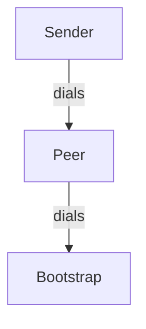

# LibP2P Implementation with Docker Swarm

This guide describes an implementation of LibP2P with the following configuration:

- MDNS (optional, yet to be done)
- Kademlia for peer routing
- GossipSub for pub/sub messaging
- QUIC for transport


## Quick Start

To get started, follow these commands:

```
# Build the Docker image
./build.sh

# Deploy to Docker Swarm
./deploy_all.sh
```

## Inspecting the output

Viewing the output shows the interaction between containers worked:

```
./inspect.sh

=================================
           BOOTSTRAP
=================================
p2p_bootstrap.1.6u86il1w2dxz@nixos    | 2024-12-17T20:45:42.610651Z  INFO p2p_service: STARTING!
p2p_bootstrap.1.6u86il1w2dxz@nixos    | 2024-12-17T20:45:42.612502Z  INFO libp2p_swarm: local_peer_id=12D3KooWQyY2G9rKZ62Wu5oXpFZ2JUiQNtVH6MDNbTv2JgT7GTTM
p2p_bootstrap.1.6u86il1w2dxz@nixos    | 2024-12-17T20:45:42.613033Z  INFO p2p_service: Local node is listening on /ip4/127.0.0.1/udp/4001/quic-v1
p2p_bootstrap.1.6u86il1w2dxz@nixos    | 2024-12-17T20:45:42.613084Z  INFO p2p_service: Local node is listening on /ip4/10.0.17.2/udp/4001/quic-v1
p2p_bootstrap.1.6u86il1w2dxz@nixos    | 2024-12-17T20:45:42.613152Z  INFO p2p_service: Local node is listening on /ip4/172.22.0.3/udp/4001/quic-v1
p2p_bootstrap.1.6u86il1w2dxz@nixos    | 2024-12-17T20:45:43.113570Z  WARN libp2p_kad::behaviour: Failed to trigger bootstrap: No known peers.
p2p_bootstrap.1.6u86il1w2dxz@nixos    | 2024-12-17T20:45:46.682342Z  INFO p2p_service: Connected to 12D3KooWNnZQT2rFbfg4cHfTPzikzkw2CHwTP7ZrNF3hUspRejuu
p2p_bootstrap.1.6u86il1w2dxz@nixos    | 2024-12-17T20:45:46.682449Z  INFO p2p_service: Added address to kademlia /ip4/10.0.17.4/udp/4001/quic-v1
p2p_bootstrap.1.6u86il1w2dxz@nixos    | 2024-12-17T20:45:46.682472Z  INFO p2p_service: Added peer to gossipsub /ip4/10.0.17.4/udp/4001/quic-v1
p2p_bootstrap.1.6u86il1w2dxz@nixos    | 2024-12-17T20:45:46.682515Z  INFO p2p_service: Other Kademlia event: RoutingUpdated { peer: PeerId("12D3KooWNnZQT2rFbfg4cHfTPzikzkw2CHwTP7ZrNF3hUspRejuu"), is_new_peer: true, addresses: [/ip4/10.0.17.4/udp/4001/quic-v1/p2p/12D3KooWNnZQT2rFbfg4cHfTPzikzkw2CHwTP7ZrNF3hUspRejuu], bucket_range: (Distance(57896044618658097711785492504343953926634992332820282019728792003956564819968), Distance(115792089237316195423570985008687907853269984665640564039457584007913129639935)), old_peer: None }
p2p_bootstrap.1.6u86il1w2dxz@nixos    | 2024-12-17T20:45:47.184113Z  INFO p2p_service: Other Kademlia event: OutboundQueryProgressed { id: QueryId(0), result: Bootstrap(Ok(BootstrapOk { peer: PeerId("12D3KooWQyY2G9rKZ62Wu5oXpFZ2JUiQNtVH6MDNbTv2JgT7GTTM"), num_remaining: 0 })), stats: QueryStats { requests: 1, success: 0, failure: 1, start: Some(Instant { tv_sec: 54661, tv_nsec: 601482055 }), end: Some(Instant { tv_sec: 54661, tv_nsec: 602941302 }) }, step: ProgressStep { count: 1, last: true } }
p2p_bootstrap.1.6u86il1w2dxz@nixos    | 2024-12-17T20:45:51.277462Z  INFO p2p_service: Got message with id: 38323236333237303236323337393839363739 from peer: 12D3KooWNnZQT2rFbfg4cHfTPzikzkw2CHwTP7ZrNF3hUspRejuu
p2p_bootstrap.1.6u86il1w2dxz@nixos    | Received raw message data: [1, 2, 3, 4]

=================================
           PEER
=================================
p2p_peer.1.wv3pjn33cowr@nixos    | 2024-12-17T20:45:46.614716Z  INFO p2p_service: STARTING!
p2p_peer.1.wv3pjn33cowr@nixos    | 2024-12-17T20:45:46.616470Z  INFO libp2p_swarm: local_peer_id=12D3KooWNnZQT2rFbfg4cHfTPzikzkw2CHwTP7ZrNF3hUspRejuu
p2p_peer.1.wv3pjn33cowr@nixos    | Now dialing in to bootstrap
p2p_peer.1.wv3pjn33cowr@nixos    | 2024-12-17T20:45:46.617045Z  INFO p2p_service: Local node is listening on /ip4/127.0.0.1/udp/4001/quic-v1
p2p_peer.1.wv3pjn33cowr@nixos    | 2024-12-17T20:45:46.617103Z  INFO p2p_service: Local node is listening on /ip4/10.0.17.4/udp/4001/quic-v1
p2p_peer.1.wv3pjn33cowr@nixos    | 2024-12-17T20:45:46.617149Z  INFO p2p_service: Local node is listening on /ip4/172.22.0.4/udp/4001/quic-v1
p2p_peer.1.wv3pjn33cowr@nixos    | Resolved 'bootstrap' to 10.0.17.2
p2p_peer.1.wv3pjn33cowr@nixos    | addr:/ip4/10.0.17.2/udp/4001/quic-v1
p2p_peer.1.wv3pjn33cowr@nixos    | Dialing: /ip4/10.0.17.2/udp/4001/quic-v1...
p2p_peer.1.wv3pjn33cowr@nixos    | Dialing /ip4/10.0.17.2/udp/4001/quic-v1 with connection 1
p2p_peer.1.wv3pjn33cowr@nixos    | 2024-12-17T20:45:46.666575Z  INFO p2p_service: Connected to 12D3KooWQyY2G9rKZ62Wu5oXpFZ2JUiQNtVH6MDNbTv2JgT7GTTM
p2p_peer.1.wv3pjn33cowr@nixos    | 2024-12-17T20:45:46.666700Z  INFO p2p_service: Added address to kademlia /ip4/10.0.17.2/udp/4001/quic-v1
p2p_peer.1.wv3pjn33cowr@nixos    | 2024-12-17T20:45:46.666725Z  INFO p2p_service: Added peer to gossipsub /ip4/10.0.17.2/udp/4001/quic-v1
p2p_peer.1.wv3pjn33cowr@nixos    | Connection Established
p2p_peer.1.wv3pjn33cowr@nixos    | 2024-12-17T20:45:46.666782Z  INFO p2p_service: Other Kademlia event: RoutingUpdated { peer: PeerId("12D3KooWQyY2G9rKZ62Wu5oXpFZ2JUiQNtVH6MDNbTv2JgT7GTTM"), is_new_peer: true, addresses: [/ip4/10.0.17.2/udp/4001/quic-v1/p2p/12D3KooWQyY2G9rKZ62Wu5oXpFZ2JUiQNtVH6MDNbTv2JgT7GTTM], bucket_range: (Distance(57896044618658097711785492504343953926634992332820282019728792003956564819968), Distance(115792089237316195423570985008687907853269984665640564039457584007913129639935)), old_peer: None }
p2p_peer.1.wv3pjn33cowr@nixos    | 2024-12-17T20:45:46.683359Z  INFO p2p_service: Other Kademlia event: RoutingUpdated { peer: PeerId("12D3KooWQyY2G9rKZ62Wu5oXpFZ2JUiQNtVH6MDNbTv2JgT7GTTM"), is_new_peer: false, addresses: [/ip4/10.0.17.2/udp/4001/quic-v1/p2p/12D3KooWQyY2G9rKZ62Wu5oXpFZ2JUiQNtVH6MDNbTv2JgT7GTTM, /ip4/10.0.17.2/udp/4001/quic-v1], bucket_range: (Distance(57896044618658097711785492504343953926634992332820282019728792003956564819968), Distance(115792089237316195423570985008687907853269984665640564039457584007913129639935)), old_peer: None }
p2p_peer.1.wv3pjn33cowr@nixos    | 2024-12-17T20:45:47.168436Z  INFO p2p_service: Other Kademlia event: OutboundQueryProgressed { id: QueryId(0), result: Bootstrap(Ok(BootstrapOk { peer: PeerId("12D3KooWNnZQT2rFbfg4cHfTPzikzkw2CHwTP7ZrNF3hUspRejuu"), num_remaining: 0 })), stats: QueryStats { requests: 1, success: 0, failure: 1, start: Some(Instant { tv_sec: 54661, tv_nsec: 585773490 }), end: Some(Instant { tv_sec: 54661, tv_nsec: 587262431 }) }, step: ProgressStep { count: 1, last: true } }
p2p_peer.1.wv3pjn33cowr@nixos    | 2024-12-17T20:45:51.175297Z  INFO p2p_service: Connected to 12D3KooWSVf5AftG5EMTt4KHLjrbCHwGphWTRnkf24JVF7LAmAyg
p2p_peer.1.wv3pjn33cowr@nixos    | 2024-12-17T20:45:51.175392Z  INFO p2p_service: Added address to kademlia /ip4/10.0.17.5/udp/4001/quic-v1
p2p_peer.1.wv3pjn33cowr@nixos    | 2024-12-17T20:45:51.175408Z  INFO p2p_service: Added peer to gossipsub /ip4/10.0.17.5/udp/4001/quic-v1
p2p_peer.1.wv3pjn33cowr@nixos    | 2024-12-17T20:45:51.175449Z  INFO p2p_service: Other Kademlia event: RoutingUpdated { peer: PeerId("12D3KooWSVf5AftG5EMTt4KHLjrbCHwGphWTRnkf24JVF7LAmAyg"), is_new_peer: true, addresses: [/ip4/10.0.17.5/udp/4001/quic-v1/p2p/12D3KooWSVf5AftG5EMTt4KHLjrbCHwGphWTRnkf24JVF7LAmAyg], bucket_range: (Distance(28948022309329048855892746252171976963317496166410141009864396001978282409984), Distance(57896044618658097711785492504343953926634992332820282019728792003956564819967)), old_peer: None }
p2p_peer.1.wv3pjn33cowr@nixos    | 2024-12-17T20:45:51.270436Z  INFO p2p_service: Got message with id: 38323236333237303236323337393839363739 from peer: 12D3KooWSVf5AftG5EMTt4KHLjrbCHwGphWTRnkf24JVF7LAmAyg
p2p_peer.1.wv3pjn33cowr@nixos    | Received raw message data: [1, 2, 3, 4]
p2p_peer.1.wv3pjn33cowr@nixos    | 2024-12-17T20:45:51.677315Z  INFO p2p_service: Other Kademlia event: OutboundQueryProgressed { id: QueryId(1), result: Bootstrap(Ok(BootstrapOk { peer: PeerId("12D3KooWNnZQT2rFbfg4cHfTPzikzkw2CHwTP7ZrNF3hUspRejuu"), num_remaining: 1 })), stats: QueryStats { requests: 2, success: 0, failure: 2, start: Some(Instant { tv_sec: 54666, tv_nsec: 94478627 }), end: Some(Instant { tv_sec: 54666, tv_nsec: 95960373 }) }, step: ProgressStep { count: 1, last: false } }
p2p_peer.1.wv3pjn33cowr@nixos    | 2024-12-17T20:45:51.677995Z  INFO p2p_service: Other Kademlia event: OutboundQueryProgressed { id: QueryId(1), result: Bootstrap(Ok(BootstrapOk { peer: PeerId("1AoKKj4dvVuMGgTJt7NPdBdfscewSYNjHjr2GZhYVDnx8H"), num_remaining: 0 })), stats: QueryStats { requests: 2, success: 0, failure: 2, start: Some(Instant { tv_sec: 54666, tv_nsec: 96251878 }), end: Some(Instant { tv_sec: 54666, tv_nsec: 96852894 }) }, step: ProgressStep { count: 2, last: true } }

=================================
           SENDER
=================================
p2p_sender.1.9s57eets1s3b@nixos    | 2024-12-17T20:45:51.126347Z  INFO p2p_service: STARTING!
p2p_sender.1.9s57eets1s3b@nixos    | 2024-12-17T20:45:51.128370Z  INFO libp2p_swarm: local_peer_id=12D3KooWSVf5AftG5EMTt4KHLjrbCHwGphWTRnkf24JVF7LAmAyg
p2p_sender.1.9s57eets1s3b@nixos    | Now dialing in to peer
p2p_sender.1.9s57eets1s3b@nixos    | 2024-12-17T20:45:51.128933Z  INFO p2p_service: Local node is listening on /ip4/127.0.0.1/udp/4001/quic-v1
p2p_sender.1.9s57eets1s3b@nixos    | 2024-12-17T20:45:51.128986Z  INFO p2p_service: Local node is listening on /ip4/10.0.17.5/udp/4001/quic-v1
p2p_sender.1.9s57eets1s3b@nixos    | 2024-12-17T20:45:51.129023Z  INFO p2p_service: Local node is listening on /ip4/172.22.0.5/udp/4001/quic-v1
p2p_sender.1.9s57eets1s3b@nixos    | Resolved 'peer' to 10.0.17.4
p2p_sender.1.9s57eets1s3b@nixos    | addr:/ip4/10.0.17.4/udp/4001/quic-v1
p2p_sender.1.9s57eets1s3b@nixos    | Dialing: /ip4/10.0.17.4/udp/4001/quic-v1...
p2p_sender.1.9s57eets1s3b@nixos    | Dialing /ip4/10.0.17.4/udp/4001/quic-v1 with connection 1
p2p_sender.1.9s57eets1s3b@nixos    | 2024-12-17T20:45:51.161071Z  INFO p2p_service: Connected to 12D3KooWNnZQT2rFbfg4cHfTPzikzkw2CHwTP7ZrNF3hUspRejuu
p2p_sender.1.9s57eets1s3b@nixos    | 2024-12-17T20:45:51.161193Z  INFO p2p_service: Added address to kademlia /ip4/10.0.17.4/udp/4001/quic-v1
p2p_sender.1.9s57eets1s3b@nixos    | 2024-12-17T20:45:51.161216Z  INFO p2p_service: Added peer to gossipsub /ip4/10.0.17.4/udp/4001/quic-v1
p2p_sender.1.9s57eets1s3b@nixos    | Connection Established
p2p_sender.1.9s57eets1s3b@nixos    | Sending message 1,2,3,4...
p2p_sender.1.9s57eets1s3b@nixos    | Now publishing data [1, 2, 3, 4] on topic some_topic
p2p_sender.1.9s57eets1s3b@nixos    | 2024-12-17T20:45:51.161265Z  INFO p2p_service: Other Kademlia event: RoutingUpdated { peer: PeerId("12D3KooWNnZQT2rFbfg4cHfTPzikzkw2CHwTP7ZrNF3hUspRejuu"), is_new_peer: true, addresses: [/ip4/10.0.17.4/udp/4001/quic-v1/p2p/12D3KooWNnZQT2rFbfg4cHfTPzikzkw2CHwTP7ZrNF3hUspRejuu], bucket_range: (Distance(28948022309329048855892746252171976963317496166410141009864396001978282409984), Distance(57896044618658097711785492504343953926634992332820282019728792003956564819967)), old_peer: None }
p2p_sender.1.9s57eets1s3b@nixos    | 2024-12-17T20:45:51.161695Z  WARN p2p_service: Could not publish to swarm. Retrying... error=InsufficientPeers
p2p_sender.1.9s57eets1s3b@nixos    | Attempt 1/10 failed, retrying in 100ms: Publishing failed
p2p_sender.1.9s57eets1s3b@nixos    | 2024-12-17T20:45:51.176339Z  INFO p2p_service: Other Kademlia event: RoutingUpdated { peer: PeerId("12D3KooWNnZQT2rFbfg4cHfTPzikzkw2CHwTP7ZrNF3hUspRejuu"), is_new_peer: false, addresses: [/ip4/10.0.17.4/udp/4001/quic-v1/p2p/12D3KooWNnZQT2rFbfg4cHfTPzikzkw2CHwTP7ZrNF3hUspRejuu, /ip4/10.0.17.4/udp/4001/quic-v1], bucket_range: (Distance(28948022309329048855892746252171976963317496166410141009864396001978282409984), Distance(57896044618658097711785492504343953926634992332820282019728792003956564819967)), old_peer: None }
p2p_sender.1.9s57eets1s3b@nixos    | Publish has been confirmed with id: 38323236333237303236323337393839363739
p2p_sender.1.9s57eets1s3b@nixos    | Sent and array of bytes 1,2,3,4 to be gossiped
p2p_sender.1.9s57eets1s3b@nixos    | 2024-12-17T20:45:51.663126Z  INFO p2p_service: Other Kademlia event: OutboundQueryProgressed { id: QueryId(0), result: Bootstrap(Ok(BootstrapOk { peer: PeerId("12D3KooWSVf5AftG5EMTt4KHLjrbCHwGphWTRnkf24JVF7LAmAyg"), num_remaining: 1 })), stats: QueryStats { requests: 1, success: 0, failure: 1, start: Some(Instant { tv_sec: 54666, tv_nsec: 80294161 }), end: Some(Instant { tv_sec: 54666, tv_nsec: 81773581 }) }, step: ProgressStep { count: 1, last: false } }
p2p_sender.1.9s57eets1s3b@nixos    | 2024-12-17T20:45:51.664026Z  INFO p2p_service: Other Kademlia event: OutboundQueryProgressed { id: QueryId(0), result: Bootstrap(Ok(BootstrapOk { peer: PeerId("1AYDsv8rPbHdC8amC5LqToezjfHeMPutmNYGGbpXpcMrzi"), num_remaining: 0 })), stats: QueryStats { requests: 1, success: 0, failure: 1, start: Some(Instant { tv_sec: 54666, tv_nsec: 82056762 }), end: Some(Instant { tv_sec: 54666, tv_nsec: 82885685 }) }, step: ProgressStep { count: 2, last: true } }
```

## Network Architecture

The implementation consists of three main components:

- Bootstrap Node: Acts as the initial entry point for the P2P network
- Peer Node: A standard network participant that connects to the bootstrap node
- Sender Node: Connects to the peer node and sends messages through the network


The network topology follows this pattern:



## Network Considerations

When deploying this system in Docker Swarm, there are important networking considerations to keep in mind:

### Docker Swarm Networking Behavior

Docker Swarm uses an internal IP load balancer which can affect network transports, particularly QUIC. This creates two key challenges:

1. Container IP Address Translation:
    - A container's internal IP address differs from the IP address other containers use to connect to it
    - This behavior is similar to NAT (Network Address Translation)
    - May require specific hole punching techniques to ensure proper connectivity

2. DNS Resolution Strategy:

    - To address the IP translation issues, we use round-robin DNS with endpoint_mode: dnsrr
    - Container discovery is handled through DNS resolution rather than direct IP addressing
    - This helps maintain consistent connectivity between containers despite the internal IP translation

This configuration ensures reliable communication between nodes while working within Docker Swarm's networking constraints.

### Exponential Backoff

Exponential backoff has been applied to dialing in to swarm nodes as nodes may be offline or rebooting as they are connecting to each other to form the network in restart situations. 

In order for this to work and to avoid sharing a `Swarm` within an `Arc<Mutex<T>>` everywhere here I am demonstrating using channels to manage asynchrony and ownership.

Each command is managed in a separate tokio spawn to handle it's EB workflow and commands are simply sent to the swarm over a channel. This means the function managing the backoff need not hold a mutable reference to the swarm. 


### Setting up on a remote server

Initialize swarm

```
docker swarm init
```

Build the app

```
./build.sh
```

Then deploy to the swarm

```
./deploy_all.sh
```

Inspect the output you should see that a message [1,2,3,4] was sent.


---

Then locally attempt to connect to the box by building the binary:

```
cargo build --release
```

Then run with the appropriate env vars:


```
ROLE=sender PORT=4004 PEER_1=/ip4/1.2.3.4/udp/4002/quic-v1 cargo run
```

Where 1.2.3.4 is the IP address of the remote machine.

You should see a second message broadcast on peers using the `./inspect.sh` script

---

Now we should setup the firewall to ensure everything is secure. 

Setup the iptables rules to block all ports aside from SSH and the service ports:

```
#!/usr/bin/env bash

# First, flush existing rules
iptables -F
iptables -X
iptables -Z

# Set default policies to DROP
iptables -P INPUT DROP
iptables -P FORWARD DROP
iptables -P OUTPUT ACCEPT

# Allow loopback traffic
iptables -A INPUT -i lo -j ACCEPT
iptables -A OUTPUT -o lo -j ACCEPT

# Allow established and related connections
iptables -A INPUT -m conntrack --ctstate ESTABLISHED,RELATED -j ACCEPT

# Allow specific ports (both TCP and UDP)
iptables -A INPUT -p tcp -m multiport --dports 4001,4002,4003 -j ACCEPT
iptables -A INPUT -p udp -m multiport --dports 4001,4002,4003 -j ACCEPT

# If you need SSH access (recommended), add:
iptables -A INPUT -p tcp --dport 22 -j ACCEPT

# Save the rules (depending on your distro, use one of these):
# For Debian/Ubuntu:
iptables-save > /etc/iptables/rules.v4
# For RHEL/CentOS:
service iptables save
```

Run the same test to see that the message is being sent.
