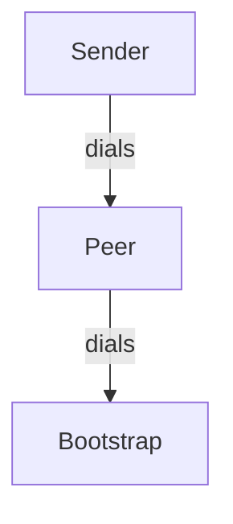

Build the dockerfile

```
./build.sh
```

Deploy the image to docker swarm

```
./deploy.sh
```

Inspect the output

```
./inspect.sh

=================================
           BOOTSTRAP
=================================
p2p_bootstrap.1.rdkrdx1epd5q@nixos    | 2024-12-15T14:34:09.836994Z  INFO p2p_service: STARTING! 01:32
p2p_bootstrap.1.rdkrdx1epd5q@nixos    | 2024-12-15T14:34:09.839379Z  INFO libp2p_swarm: local_peer_id=12D3KooWKLEBQhKoiGeQG4svMKaPaLEjSDFwPBDgbD7t8qiax5wY
p2p_bootstrap.1.rdkrdx1epd5q@nixos    | 2024-12-15T14:34:09.840713Z  INFO p2p_service: Local node is listening on /ip4/127.0.0.1/udp/4001/quic-v1
p2p_bootstrap.1.rdkrdx1epd5q@nixos    | 2024-12-15T14:34:09.840724Z  INFO p2p_service: Local node is listening on /ip4/10.0.22.2/udp/4001/quic-v1
p2p_bootstrap.1.rdkrdx1epd5q@nixos    | 2024-12-15T14:34:09.840731Z  INFO p2p_service: Local node is listening on /ip4/172.22.0.3/udp/4001/quic-v1
p2p_bootstrap.1.rdkrdx1epd5q@nixos    | 2024-12-15T14:34:10.341057Z  WARN libp2p_kad::behaviour: Failed to trigger bootstrap: No known peers.
p2p_bootstrap.1.rdkrdx1epd5q@nixos    | 2024-12-15T14:34:23.979496Z  INFO p2p_service: Connected to 12D3KooWKRYt7UE2SgzN4SpkJmizT6oSF32MDisfAgm5MsmUpt3V
p2p_bootstrap.1.rdkrdx1epd5q@nixos    | 2024-12-15T14:34:23.979519Z  INFO p2p_service: Added address to kademlia /ip4/10.0.22.4/udp/4001/quic-v1
p2p_bootstrap.1.rdkrdx1epd5q@nixos    | 2024-12-15T14:34:23.979523Z  INFO p2p_service: Added peer to gossipsub /ip4/10.0.22.4/udp/4001/quic-v1
p2p_bootstrap.1.rdkrdx1epd5q@nixos    | 2024-12-15T14:34:23.979528Z  INFO p2p_service: Other Kademlia event: RoutingUpdated { peer: PeerId("12D3KooWKRYt7UE2SgzN4SpkJmizT6oSF32MDisfAgm5MsmUpt3V"), is_new_peer: true, addresses: [/ip4/10.0.22.4/udp/4001/quic-v1/p2p/12D3KooWKRYt7UE2SgzN4SpkJmizT6oSF32MDisfAgm5MsmUpt3V], bucket_range: (Distance(14474011154664524427946373126085988481658748083205070504932198000989141204992), Distance(28948022309329048855892746252171976963317496166410141009864396001978282409983)), old_peer: None }
p2p_bootstrap.1.rdkrdx1epd5q@nixos    | 2024-12-15T14:34:24.480142Z  INFO p2p_service: Other Kademlia event: OutboundQueryProgressed { id: QueryId(0), result: Bootstrap(Ok(BootstrapOk { peer: PeerId("12D3KooWKLEBQhKoiGeQG4svMKaPaLEjSDFwPBDgbD7t8qiax5wY"), num_remaining: 2 })), stats: QueryStats { requests: 1, success: 0, failure: 1, start: Some(Instant { tv_sec: 210080, tv_nsec: 692863774 }), end: Some(Instant { tv_sec: 210080, tv_nsec: 693310144 }) }, step: ProgressStep { count: 1, last: false } }
p2p_bootstrap.1.rdkrdx1epd5q@nixos    | 2024-12-15T14:34:24.480367Z  INFO p2p_service: Other Kademlia event: OutboundQueryProgressed { id: QueryId(0), result: Bootstrap(Ok(BootstrapOk { peer: PeerId("1Aiwc45Yket7BhdLWUbBJ2pUcLpMcJgwZY2LpRuA1xMBTF"), num_remaining: 1 })), stats: QueryStats { requests: 1, success: 0, failure: 1, start: Some(Instant { tv_sec: 210080, tv_nsec: 693382330 }), end: Some(Instant { tv_sec: 210080, tv_nsec: 693559108 }) }, step: ProgressStep { count: 2, last: false } }
p2p_bootstrap.1.rdkrdx1epd5q@nixos    | 2024-12-15T14:34:24.480504Z  INFO p2p_service: Other Kademlia event: OutboundQueryProgressed { id: QueryId(0), result: Bootstrap(Ok(BootstrapOk { peer: PeerId("1AZzdn4RhVFYrsJ5W1gt6QSvZueisxiQnSUNHJGgprVDGR"), num_remaining: 0 })), stats: QueryStats { requests: 1, success: 0, failure: 1, start: Some(Instant { tv_sec: 210080, tv_nsec: 693594826 }), end: Some(Instant { tv_sec: 210080, tv_nsec: 693716598 }) }, step: ProgressStep { count: 3, last: true } }
p2p_bootstrap.1.rdkrdx1epd5q@nixos    | 2024-12-15T14:34:39.253246Z  INFO p2p_service: Got message with id: 38323236333237303236323337393839363739 from peer: 12D3KooWKRYt7UE2SgzN4SpkJmizT6oSF32MDisfAgm5MsmUpt3V
p2p_bootstrap.1.rdkrdx1epd5q@nixos    | Received raw message data: [1, 2, 3, 4]

=================================
           PEER
=================================
p2p_peer.1.g79nb2159hjb@nixos    | 2024-12-15T14:34:13.926332Z  INFO p2p_service: STARTING! 01:32
p2p_peer.1.g79nb2159hjb@nixos    | 2024-12-15T14:34:13.926971Z  INFO libp2p_swarm: local_peer_id=12D3KooWKRYt7UE2SgzN4SpkJmizT6oSF32MDisfAgm5MsmUpt3V
p2p_peer.1.g79nb2159hjb@nixos    | Waiting 10 seconds before dialing...
p2p_peer.1.g79nb2159hjb@nixos    | Now dialing in to bootstrap
p2p_peer.1.g79nb2159hjb@nixos    | addr:/ip4/10.0.22.2/udp/4001/quic-v1
p2p_peer.1.g79nb2159hjb@nixos    | Dialing: /ip4/10.0.22.2/udp/4001/quic-v1...
p2p_peer.1.g79nb2159hjb@nixos    | Finished dialing: /ip4/10.0.22.2/udp/4001/quic-v1
p2p_peer.1.g79nb2159hjb@nixos    | 2024-12-15T14:34:23.977593Z  INFO p2p_service: Local node is listening on /ip4/127.0.0.1/udp/4001/quic-v1
p2p_peer.1.g79nb2159hjb@nixos    | 2024-12-15T14:34:23.977605Z  INFO p2p_service: Local node is listening on /ip4/10.0.22.4/udp/4001/quic-v1
p2p_peer.1.g79nb2159hjb@nixos    | 2024-12-15T14:34:23.977611Z  INFO p2p_service: Local node is listening on /ip4/172.22.0.4/udp/4001/quic-v1
p2p_peer.1.g79nb2159hjb@nixos    | 2024-12-15T14:34:23.979227Z  INFO p2p_service: Connected to 12D3KooWKLEBQhKoiGeQG4svMKaPaLEjSDFwPBDgbD7t8qiax5wY
p2p_peer.1.g79nb2159hjb@nixos    | 2024-12-15T14:34:23.979248Z  INFO p2p_service: Added address to kademlia /ip4/10.0.22.2/udp/4001/quic-v1
p2p_peer.1.g79nb2159hjb@nixos    | 2024-12-15T14:34:23.979251Z  INFO p2p_service: Added peer to gossipsub /ip4/10.0.22.2/udp/4001/quic-v1
p2p_peer.1.g79nb2159hjb@nixos    | 2024-12-15T14:34:23.979255Z  INFO p2p_service: Other Kademlia event: RoutingUpdated { peer: PeerId("12D3KooWKLEBQhKoiGeQG4svMKaPaLEjSDFwPBDgbD7t8qiax5wY"), is_new_peer: true, addresses: [/ip4/10.0.22.2/udp/4001/quic-v1/p2p/12D3KooWKLEBQhKoiGeQG4svMKaPaLEjSDFwPBDgbD7t8qiax5wY], bucket_range: (Distance(14474011154664524427946373126085988481658748083205070504932198000989141204992), Distance(28948022309329048855892746252171976963317496166410141009864396001978282409983)), old_peer: None }
p2p_peer.1.g79nb2159hjb@nixos    | 2024-12-15T14:34:23.979701Z  INFO p2p_service: Other Kademlia event: RoutingUpdated { peer: PeerId("12D3KooWKLEBQhKoiGeQG4svMKaPaLEjSDFwPBDgbD7t8qiax5wY"), is_new_peer: false, addresses: [/ip4/10.0.22.2/udp/4001/quic-v1/p2p/12D3KooWKLEBQhKoiGeQG4svMKaPaLEjSDFwPBDgbD7t8qiax5wY, /ip4/10.0.22.2/udp/4001/quic-v1], bucket_range: (Distance(14474011154664524427946373126085988481658748083205070504932198000989141204992), Distance(28948022309329048855892746252171976963317496166410141009864396001978282409983)), old_peer: None }
p2p_peer.1.g79nb2159hjb@nixos    | 2024-12-15T14:34:24.480142Z  INFO p2p_service: Other Kademlia event: OutboundQueryProgressed { id: QueryId(0), result: Bootstrap(Ok(BootstrapOk { peer: PeerId("12D3KooWKRYt7UE2SgzN4SpkJmizT6oSF32MDisfAgm5MsmUpt3V"), num_remaining: 2 })), stats: QueryStats { requests: 1, success: 0, failure: 1, start: Some(Instant { tv_sec: 210080, tv_nsec: 692667144 }), end: Some(Instant { tv_sec: 210080, tv_nsec: 693310108 }) }, step: ProgressStep { count: 1, last: false } }
p2p_peer.1.g79nb2159hjb@nixos    | 2024-12-15T14:34:24.480353Z  INFO p2p_service: Other Kademlia event: OutboundQueryProgressed { id: QueryId(0), result: Bootstrap(Ok(BootstrapOk { peer: PeerId("1AWv2KoV15fMWdXF46WV7t2XgJjWx6cQiw7xHNSFNFv6qh"), num_remaining: 1 })), stats: QueryStats { requests: 1, success: 0, failure: 1, start: Some(Instant { tv_sec: 210080, tv_nsec: 693382413 }), end: Some(Instant { tv_sec: 210080, tv_nsec: 693544308 }) }, step: ProgressStep { count: 2, last: false } }
p2p_peer.1.g79nb2159hjb@nixos    | 2024-12-15T14:34:24.480519Z  INFO p2p_service: Other Kademlia event: OutboundQueryProgressed { id: QueryId(0), result: Bootstrap(Ok(BootstrapOk { peer: PeerId("1AeGLpQJhtQssLuhcNq6kMUaSLfJG1gdqpwQaurP5uvS4Y"), num_remaining: 0 })), stats: QueryStats { requests: 1, success: 0, failure: 1, start: Some(Instant { tv_sec: 210080, tv_nsec: 693582592 }), end: Some(Instant { tv_sec: 210080, tv_nsec: 693733429 }) }, step: ProgressStep { count: 3, last: true } }
p2p_peer.1.g79nb2159hjb@nixos    | 2024-12-15T14:34:29.253432Z  INFO p2p_service: Connected to 12D3KooWAiKpyvtt1DrLZYFvLtXgXFhWi6HKmBVh8X1gvHtvJ2fW
p2p_peer.1.g79nb2159hjb@nixos    | 2024-12-15T14:34:29.253450Z  INFO p2p_service: Added address to kademlia /ip4/10.0.22.5/udp/4001/quic-v1
p2p_peer.1.g79nb2159hjb@nixos    | 2024-12-15T14:34:29.253453Z  INFO p2p_service: Added peer to gossipsub /ip4/10.0.22.5/udp/4001/quic-v1
p2p_peer.1.g79nb2159hjb@nixos    | 2024-12-15T14:34:29.253458Z  INFO p2p_service: Other Kademlia event: RoutingUpdated { peer: PeerId("12D3KooWAiKpyvtt1DrLZYFvLtXgXFhWi6HKmBVh8X1gvHtvJ2fW"), is_new_peer: true, addresses: [/ip4/10.0.22.5/udp/4001/quic-v1/p2p/12D3KooWAiKpyvtt1DrLZYFvLtXgXFhWi6HKmBVh8X1gvHtvJ2fW], bucket_range: (Distance(28948022309329048855892746252171976963317496166410141009864396001978282409984), Distance(57896044618658097711785492504343953926634992332820282019728792003956564819967)), old_peer: None }
p2p_peer.1.g79nb2159hjb@nixos    | 2024-12-15T14:34:29.754100Z  INFO p2p_service: Other Kademlia event: OutboundQueryProgressed { id: QueryId(1), result: Bootstrap(Ok(BootstrapOk { peer: PeerId("12D3KooWKRYt7UE2SgzN4SpkJmizT6oSF32MDisfAgm5MsmUpt3V"), num_remaining: 2 })), stats: QueryStats { requests: 2, success: 0, failure: 2, start: Some(Instant { tv_sec: 210085, tv_nsec: 966885002 }), end: Some(Instant { tv_sec: 210085, tv_nsec: 967287141 }) }, step: ProgressStep { count: 1, last: false } }
p2p_peer.1.g79nb2159hjb@nixos    | 2024-12-15T14:34:29.754344Z  INFO p2p_service: Other Kademlia event: OutboundQueryProgressed { id: QueryId(1), result: Bootstrap(Ok(BootstrapOk { peer: PeerId("1AoAAPEfiT6byU8sh9UAKZNdqL88PfSR94iTcf1urvyhzf"), num_remaining: 1 })), stats: QueryStats { requests: 2, success: 0, failure: 2, start: Some(Instant { tv_sec: 210085, tv_nsec: 967334866 }), end: Some(Instant { tv_sec: 210085, tv_nsec: 967529128 }) }, step: ProgressStep { count: 2, last: false } }
p2p_peer.1.g79nb2159hjb@nixos    | 2024-12-15T14:34:29.754493Z  INFO p2p_service: Other Kademlia event: OutboundQueryProgressed { id: QueryId(1), result: Bootstrap(Ok(BootstrapOk { peer: PeerId("1AjRS25F3E3s2Qz9W2NsmXVwNxbQubkQUygeb3shuCoJkK"), num_remaining: 0 })), stats: QueryStats { requests: 2, success: 0, failure: 2, start: Some(Instant { tv_sec: 210085, tv_nsec: 967571003 }), end: Some(Instant { tv_sec: 210085, tv_nsec: 967705847 }) }, step: ProgressStep { count: 3, last: true } }
p2p_peer.1.g79nb2159hjb@nixos    | 2024-12-15T14:34:39.252874Z  INFO p2p_service: Got message with id: 38323236333237303236323337393839363739 from peer: 12D3KooWAiKpyvtt1DrLZYFvLtXgXFhWi6HKmBVh8X1gvHtvJ2fW
p2p_peer.1.g79nb2159hjb@nixos    | Received raw message data: [1, 2, 3, 4]

=================================
           SENDER
=================================
p2p_sender.1.cns70zxuyhyc@nixos    | 2024-12-15T14:34:18.232395Z  INFO p2p_service: STARTING! 01:32
p2p_sender.1.cns70zxuyhyc@nixos    | 2024-12-15T14:34:18.233022Z  INFO libp2p_swarm: local_peer_id=12D3KooWAiKpyvtt1DrLZYFvLtXgXFhWi6HKmBVh8X1gvHtvJ2fW
p2p_sender.1.cns70zxuyhyc@nixos    | Waiting 11 seconds before dialing...
p2p_sender.1.cns70zxuyhyc@nixos    | Now dialing in to peer
p2p_sender.1.cns70zxuyhyc@nixos    | addr:/ip4/10.0.22.4/udp/4001/quic-v1
p2p_sender.1.cns70zxuyhyc@nixos    | Dialing: /ip4/10.0.22.4/udp/4001/quic-v1...
p2p_sender.1.cns70zxuyhyc@nixos    | Finished dialing: /ip4/10.0.22.4/udp/4001/quic-v1
p2p_sender.1.cns70zxuyhyc@nixos    | Waiting for 10 seconds for network to settle...
p2p_sender.1.cns70zxuyhyc@nixos    | 2024-12-15T14:34:29.252127Z  INFO p2p_service: Local node is listening on /ip4/127.0.0.1/udp/4001/quic-v1
p2p_sender.1.cns70zxuyhyc@nixos    | 2024-12-15T14:34:29.252136Z  INFO p2p_service: Local node is listening on /ip4/10.0.22.5/udp/4001/quic-v1
p2p_sender.1.cns70zxuyhyc@nixos    | 2024-12-15T14:34:29.252143Z  INFO p2p_service: Local node is listening on /ip4/172.22.0.5/udp/4001/quic-v1
p2p_sender.1.cns70zxuyhyc@nixos    | 2024-12-15T14:34:29.253084Z  INFO p2p_service: Connected to 12D3KooWKRYt7UE2SgzN4SpkJmizT6oSF32MDisfAgm5MsmUpt3V
p2p_sender.1.cns70zxuyhyc@nixos    | 2024-12-15T14:34:29.253100Z  INFO p2p_service: Added address to kademlia /ip4/10.0.22.4/udp/4001/quic-v1
p2p_sender.1.cns70zxuyhyc@nixos    | 2024-12-15T14:34:29.253103Z  INFO p2p_service: Added peer to gossipsub /ip4/10.0.22.4/udp/4001/quic-v1
p2p_sender.1.cns70zxuyhyc@nixos    | 2024-12-15T14:34:29.253107Z  INFO p2p_service: Other Kademlia event: RoutingUpdated { peer: PeerId("12D3KooWKRYt7UE2SgzN4SpkJmizT6oSF32MDisfAgm5MsmUpt3V"), is_new_peer: true, addresses: [/ip4/10.0.22.4/udp/4001/quic-v1/p2p/12D3KooWKRYt7UE2SgzN4SpkJmizT6oSF32MDisfAgm5MsmUpt3V], bucket_range: (Distance(28948022309329048855892746252171976963317496166410141009864396001978282409984), Distance(57896044618658097711785492504343953926634992332820282019728792003956564819967)), old_peer: None }
p2p_sender.1.cns70zxuyhyc@nixos    | 2024-12-15T14:34:29.253629Z  INFO p2p_service: Other Kademlia event: RoutingUpdated { peer: PeerId("12D3KooWKRYt7UE2SgzN4SpkJmizT6oSF32MDisfAgm5MsmUpt3V"), is_new_peer: false, addresses: [/ip4/10.0.22.4/udp/4001/quic-v1/p2p/12D3KooWKRYt7UE2SgzN4SpkJmizT6oSF32MDisfAgm5MsmUpt3V, /ip4/10.0.22.4/udp/4001/quic-v1], bucket_range: (Distance(28948022309329048855892746252171976963317496166410141009864396001978282409984), Distance(57896044618658097711785492504343953926634992332820282019728792003956564819967)), old_peer: None }
p2p_sender.1.cns70zxuyhyc@nixos    | 2024-12-15T14:34:29.753977Z  INFO p2p_service: Other Kademlia event: OutboundQueryProgressed { id: QueryId(0), result: Bootstrap(Ok(BootstrapOk { peer: PeerId("12D3KooWAiKpyvtt1DrLZYFvLtXgXFhWi6HKmBVh8X1gvHtvJ2fW"), num_remaining: 1 })), stats: QueryStats { requests: 1, success: 0, failure: 1, start: Some(Instant { tv_sec: 210085, tv_nsec: 966631893 }), end: Some(Instant { tv_sec: 210085, tv_nsec: 967155941 }) }, step: ProgressStep { count: 1, last: false } }
p2p_sender.1.cns70zxuyhyc@nixos    | 2024-12-15T14:34:29.754244Z  INFO p2p_service: Other Kademlia event: OutboundQueryProgressed { id: QueryId(0), result: Bootstrap(Ok(BootstrapOk { peer: PeerId("1Acx27odtCvHPdXBVmYRvQtuC53nBLgi8ZbEC4c96RTKY5"), num_remaining: 0 })), stats: QueryStats { requests: 1, success: 0, failure: 1, start: Some(Instant { tv_sec: 210085, tv_nsec: 967227898 }), end: Some(Instant { tv_sec: 210085, tv_nsec: 967456486 }) }, step: ProgressStep { count: 2, last: true } }
p2p_sender.1.cns70zxuyhyc@nixos    | Finished waiting!
p2p_sender.1.cns70zxuyhyc@nixos    | Sending message 1,2,3,4
p2p_sender.1.cns70zxuyhyc@nixos    | Sent and array of bytes 1,2,3,4 to be gossiped

```


Topology:



Points to NOTE:

- Swarm uses an internal IP load balancer which might be playing up with network transports possibly QUIC
- This means that a container's internal IP address is different to the IP address a second container uses to connect to it.
- This is similar to NAT and may require specific hole punching.
- To avoid this I have used round robin IPs with `endpoint_mode: dnsrr` and then used the resolving dns to determine the IP.
